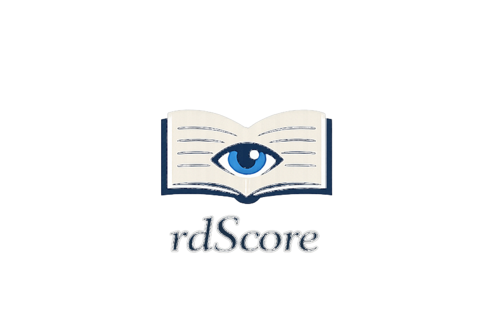

<p align="center">
  
</p>

# rdScore

Lightweight PDF reader designed for musicians, rehearsal, study, and concert preparation.  
Lecteur PDF léger conçu pour les musiciens, la répétition, l’étude et la préparation de concert.

---

## 🇬🇧 Overview

rdScore is a minimalist PDF reader designed primarily for musicians.

It focuses on keyboard control, fullscreen readability, and reliable page navigation during rehearsal, individual practice, recording sessions, and concert preparation.

Main features include:

- Fullscreen mode
- Reliable keyboard navigation
- Bluetooth pedal compatibility
- Two-page layout
- Zoom and scroll control
- Page extraction for individual parts

---

## 🇫🇷 Présentation

rdScore est un lecteur PDF minimaliste conçu principalement pour les musiciens.

Il privilégie le contrôle clavier, la lisibilité plein écran et une navigation fiable entre les pages en répétition, en travail individuel, en enregistrement et en préparation de concert.

Fonctionnalités principales :

- Mode plein écran
- Navigation clavier fiable
- Compatibilité pédale Bluetooth
- Mode 1 page / 2 pages
- Zoom et défilement
- Extraction de pages pour parties individuelles

---

# Features / Fonctionnalités

## Display

- Fullscreen mode (`f`)
- 1-page / 2-page layout (`1` / `2`)
- Intelligent centering
- Automatic fit-to-screen
- Zoom (`Ctrl +`, `Ctrl -`, `Ctrl 0`)
- Scroll when zoomed

## Navigation

| Key | Action |
|-----|--------|
| ← / → | Previous / Next page (zoom = 100%) |
| ↑ / ↓ | Scroll when zoomed |
| PageUp / PageDown | Previous / Next page |
| Space / Backspace | Previous / Next page |
| g | Go to page |
| e | Extract page range |
| F1 / ? | Help |
| Esc | Quit |

---

# Bluetooth Pedal Support / Compatibilité pédale Bluetooth

**EN**

Most Bluetooth pedals emulate keyboard keys (arrow keys or PageUp/PageDown).

rdScore works out of the box with standard pedals configured as:

- Left arrow (or PageUp) → Previous page  
- Right arrow (or PageDown) → Next page  

No specific driver or configuration required.

**FR**

La plupart des pédales Bluetooth simulent des touches clavier (flèches ou PageUp/PageDown).

rdScore fonctionne immédiatement avec une pédale configurée ainsi :

- Flèche gauche (ou PageUp) → Page précédente  
- Flèche droite (ou PageDown) → Page suivante  

Aucune configuration spécifique n’est nécessaire.

---

# Command Line Usage / Utilisation en ligne de commande

```bash
rdScore file.pdf
rdScore --version

---

---

## Build & Installation / Compilation et installation

### English

### Dependencies

rdScore requires GTK+3, Poppler (glib binding), and qpdf.

On Debian/Ubuntu-based systems:

sudo apt install libgtk-3-dev libpoppler-glib-dev qpdf

### Compilation

Compile rdScore with:

g++ -O2 -std=c++17 rdScore.cpp -o rdScore \
$(pkg-config --cflags --libs gtk+-3.0 poppler-glib)

### Local Installation

To install rdScore locally for the current user:

mkdir -p ~/.local/bin
cp rdScore ~/.local/bin/
chmod +x ~/.local/bin/rdScore

Make sure that ~/.local/bin is included in your PATH.

### Desktop Integration

To integrate rdScore into your desktop environment:

mkdir -p ~/.local/share/applications
cp rdscore.desktop ~/.local/share/applications/

To optionally set it as the default PDF reader:

xdg-mime default rdscore.desktop application/pdf


### Français

### Dépendances

rdScore nécessite GTK+3, Poppler (binding glib) et qpdf.

Sur les systèmes Debian/Ubuntu :

sudo apt install libgtk-3-dev libpoppler-glib-dev qpdf

### Compilation

Compilez rdScore avec :

g++ -O2 -std=c++17 rdScore.cpp -o rdScore \
$(pkg-config --cflags --libs gtk+-3.0 poppler-glib)

### Installation locale

Pour installer rdScore pour l’utilisateur courant :

mkdir -p ~/.local/bin
cp rdScore ~/.local/bin/
chmod +x ~/.local/bin/rdScore

Vérifiez que ~/.local/bin est présent dans votre variable d’environnement PATH.

### Intégration au bureau

Pour intégrer rdScore à votre environnement graphique :

mkdir -p ~/.local/share/applications
cp rdscore.desktop ~/.local/share/applications/

Pour le définir comme lecteur PDF par défaut (optionnel) :

xdg-mime default rdscore.desktop application/pdf


## License / Licence

GNU General Public License v3.0


## Author / Auteur

Mihai Cristescu  
2026

